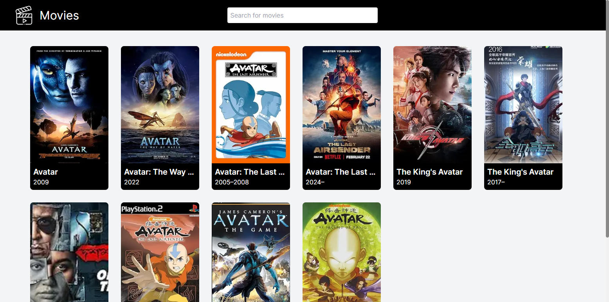

# Movies Page

This is a technical test for the position of Junior Frontend Developer at [Kai Evolve S.A.S.](https://www.linkedin.com/company/kaievolve/) The project consist in a web app to search movies usign the api [OMDb](https://www.omdbapi.com/)

## Preview



## Features

-   Pagination for show all the data searched
-   Automatic request when you type something in the search bar

## Technologies

-   [Next.js](https://nextjs.org/): The react framework for the web
- [Tailwindcss](https://v2.tailwindcss.com/): A utility-first CSS framework packed with classes like flex, pt-4, text-center and rotate-90 that can be composed to build any design, directly in your markup.
- [Shadcn/UI](https://ui.shadcn.com/): Beautifully designed components that you can copy and paste into your apps. Accessible. Customizable. Open Source.
- [React Icons](https://react-icons.github.io/react-icons/): Include popular icons in your React projects easily with react-icons, which utilizes ES6 imports that allows you to include only the icons that your project is using.

## Installation

1. Clone the repository

```
git clone https://github.com/movies
```

2. Install all dependencies

```
pnpm install
```

3. Run the project

```
pnpm run dev
```

4. For default, the page will be shown here. [Click me](http://localhost:3000)

## Demo

If you don't want to install the project, you can see a demo deployment here. [Demo](https://movies-page.pages.dev)